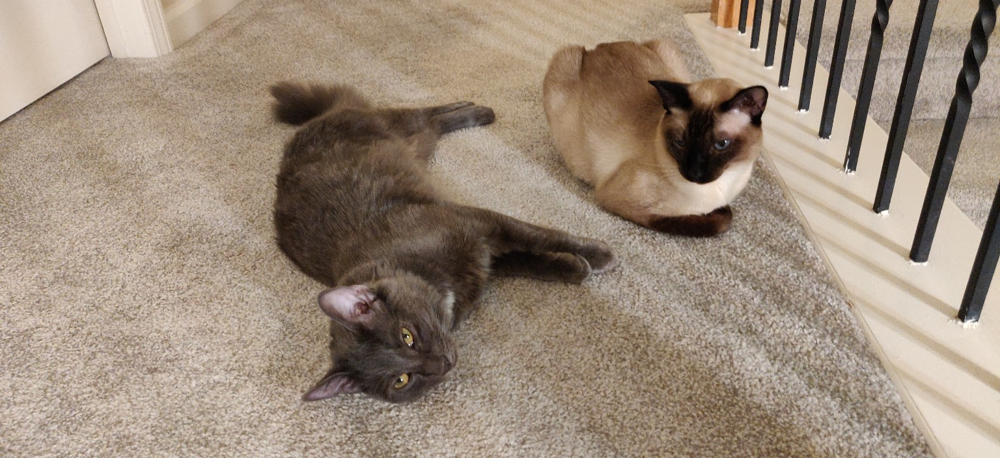

> Write a story about these two cats. The Siamese cat on the right is a girl, her name is Marcia. She is three years old. The boy on the left is 6 months old, his name is Leon.

Marcia, the elegant three-year-old Siamese cat, was quite accustomed to having the entirety of the house as her domain. Every corner, every perch, every cozy nook was hers, and she'd basked in the attention of her humans. Her days consisted of lounging by the sunniest window, playing with her favorite toys, and indulging in luxurious naps.

Then came Leon.

Leon, a sprightly 6-month-old kitten with a grayish-blue coat, was the newest addition to the family. From the moment he tumbled into the house, Marcia could tell he was bursting with energy. Leon was curious about everything, from chasing his own tail to the sparkling reflections cast by Marcia's jeweled collar.

Initially, Marcia was a bit wary of this rambunctious newcomer. She would watch from a distance as Leon made rookie mistakes, like getting his head stuck in a tissue box or sliding uncontrollably on the wooden floor. It was amusing, yet annoying. Here was this youngster, turning her peaceful kingdom into a playground.

However, as the days turned into weeks, something began to change. Leon, with his insatiable curiosity, would often find himself in tight spots. Whether he was stuck on a high shelf or entangled in a curtain, Marcia found herself coming to his rescue. Perhaps it was her maternal instincts or simply the realization that the little guy needed guidance.

The two began to bond. Marcia would teach Leon the art of stealth, showing him how to stalk a toy mouse or pounce on a feathered wand. Leon, in turn, would share his youthful zest for life, reminding Marcia of the joys of simple play. Their dynamic became a beautiful blend of wisdom and wonder.

Nights found them curled up together, with Leon often nestled against Marcia's warm side, their purrs synchronizing in a harmonious lullaby. They'd share stories of their day – Marcia recounting tales from her younger years and Leon chattering about his latest discoveries.

Over time, the house that was once ruled solely by Marcia became a shared kingdom of two feline royals. Their subjects, the humans, watched in delight as the two formed an inseparable bond. Marcia, with her grace and elegance, and Leon, with his youthful exuberance, became the heart and soul of the home. And while they had their occasional skirmishes over toys or the best spot on the couch, it was evident to all that their bond was unbreakable.

Thus, in a house filled with laughter, play, and endless cat antics, Marcia and Leon wrote their tale—one of friendship, growth, and the magical bond shared between two unlikely companions.
