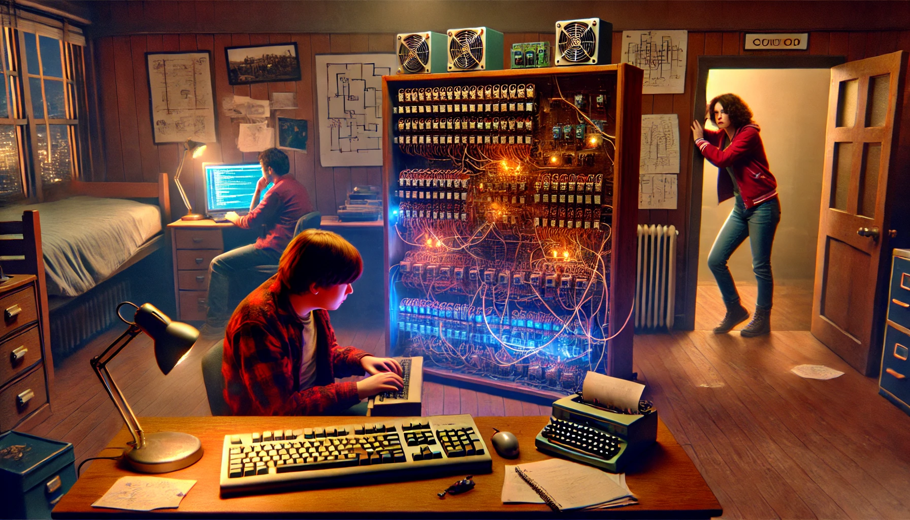

> In a world where AI assists students with homework, universities make an unexpected policy change: AI usage becomes mandatory for all assignments. Students must submit their complete AI conversation logs alongside their work, and grades depend on their ability to effectively guide AI tools. Professors strictly enforce this policy, penalizing any direct human editing. "Everything must be done through AI," they insist.
>
> As AI becomes mandatory, demand spikes and access becomes limited. Students face long queues or must pay premium prices for immediate access. Ironically, many students begin "cheating" by writing assignments themselves and fabricating AI conversations to satisfy the requirements.
>
> I asked Claude to write a story about it.

Mike's fingers moved across the keyboard with practiced precision as he implemented a red-black tree from scratch. The gentle click-clack of mechanical switches was interrupted by a sharp knock on his dorm room door.

"Hide that!" Tom hissed from his desk across the room, where he was crafting a fake dialogue with CodeCompanion AI. Mike quickly minimized his code editor and opened a blank AI chat window.

Lisa burst in, her laptop clutched to her chest. "Guys, we've got a problem. Professor Yang is doing random code generation audits. She's checking timestamps on the AI conversation logs against the neural pattern analysis."

Mike felt his stomach drop. He'd gotten sloppy lately, sometimes coding for hours before remembering to generate the corresponding AI dialogue.

"How thorough is the analysis?" Tom asked, already deleting half of his fabricated conversation.

"Enough to catch Jenny," Lisa said. "She got called out in Algorithm Design for writing a Dijkstra implementation herself. Yang said her 'AI interaction patterns showed suspicious efficiency and lack of typical trial-and-error progression.'"

Mike glanced at his minimized editor window, where his perfectly balanced red-black tree implementation waited. Three hours of work, not a single AI prompt. The new academic integrity violation would mean automatic failure.

"Here," Lisa said, pulling up a chair. "I found a way to make the fake logs more convincing. You have to add random waits between messages, throw in some syntactically correct but logically broken attempts, basically mimic how a real student would struggle with the AI."

Tom snorted. "Remember when we used to worry about students using AI to cheat? Now we're sitting here manually coding binary trees and graphing algorithms like criminals."

"It's not just about passing," Mike said, opening a new document to begin fabricating his AI conversation. "I tried doing the binary search assignment with CodeCompanion last week. Actually tried. It generated this perfectly optimized solution, but I didn't understand how it worked. Not really."

Lisa nodded. "That's why half the senior class is running underground study groups. Real coding, real debugging. No AI allowed. Did you hear about the new job interviews? Companies are starting to test candidates by having them debug intentionally broken AI-generated code."

"Speaking of which," Tom said, "anyone want to join the binary tree study session tonight? We're meeting in the basement of the old library. No devices allowed, just whiteboards and markers."

Mike was about to answer when a notification popped up on his screen: "ATTENTION: Due to unprecedented demand, CodeCompanion access will be limited to 30 minutes per student per day. Premium unlimited access available for $49.99/month."

"Perfect," Lisa said, "now we have an excuse for why our AI conversations are so short. Coming to the study group, Mike?"

He looked at his hidden red-black tree code, then at the blank AI chat window. "Yeah," he said. "But first I need to spend an hour making it look like I spent six hours failing to code this with AI."

That night, in the dimly lit library basement, two dozen students gathered around whiteboards covered in hand-drawn tree diagrams and sorting algorithms. They passed around paperback copies of Knuth's "The Art of Computer Programming" like contraband, discussing balanced trees and graph traversal in whispers.

When Mike finally got back to his dorm, he found an email from Professor Yang: "Your latest assignment shows suboptimal AI utilization. Please schedule a meeting to discuss improving your prompt engineering skills. Remember: The ability to write code manually is obsolete. Your future depends on mastering AI collaboration."

He closed the email and pulled out his notebook, filled with hand-written pseudocode and algorithm analyses. In the margins, someone had scrawled: "The real bug is in the system."
