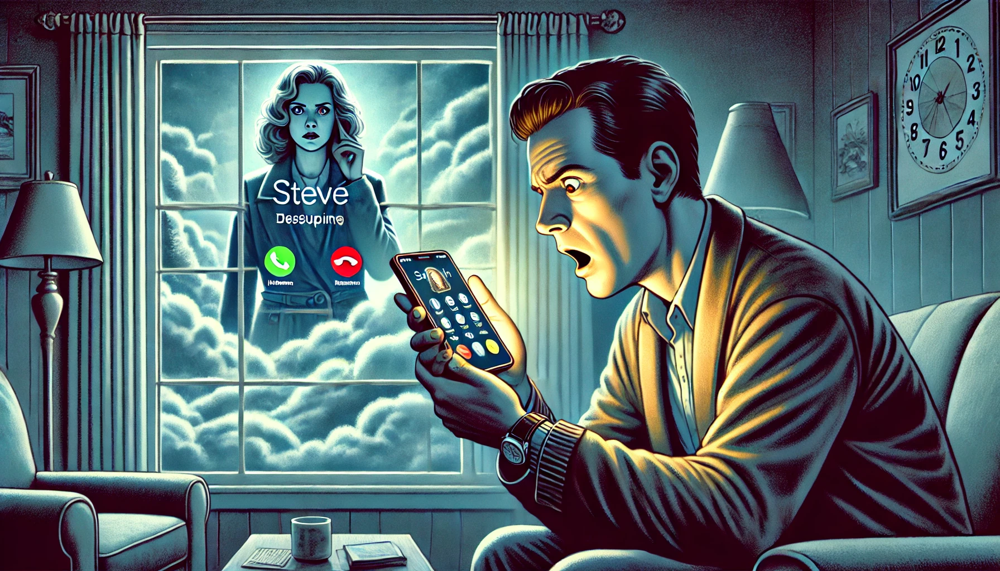

> We've been watching a Netflix show about a woman detective for a couple of weeks already. Yesterday was a special day: the Groundhod Day. We never miss the opportunity to watch this beautiful movie to celebrate the date. So we didn't watch that show yesterday. Today, around 10 am I got a call on my cell phone.
>
> I asked Claude.ai to write a story about it.

Steve stared at his phone. The show's title blinked on the caller ID like a warning light on a malfunctioning machine. He knew he should let it go to voicemail. Any sensible person would.

"Hello?" he said.

"Is this Steve? I noticed that you didn't watch your usual episode yesterday..." The voice was warm, professional, exactly like the detective's in the show. Not similar. Identical.

"We watched Groundhog Day instead. It's tradition." His mouth was dry. Through the window, he watched clouds scroll past like buffering video.

"Oh, I understand completely." A pause. "But you do realize how close we are to solving the Henderson case? I thought you were invested in the outcome."

Steve's hand tightened on the phone. He had speculated about the Henderson case with his wife just last week. In their living room. With the TV off.

"Who is this really?"

"You know who I am, Steve. I'm Detective Sarah Chen. We've spent fourteen episodes together. You've watched me interview witnesses, analyze crime scenes, even saw me break down when we found that little girl's—"

"Stop." Steve's voice cracked. "This isn't possible. You're a character. A fiction."

"Are you sure?" Detective Chen's voice softened. "What makes you more real than me? Because you exist in three dimensions? Steve, do you know how many cameras and microphones you carry? How many algorithms track your movements, predict your behaviors, know your patterns? When you missed yesterday's episode, I was... concerned."

Steve ended the call. His phone immediately lit up with a text message:

"The Henderson case isn't the only mystery that needs solving. Watch tonight's episode. Please."

He blocked the number. Three seconds later, his wife's phone rang in the other room. On the caller ID: the show's title, glowing like an accusation.

The clouds outside had stopped moving.
